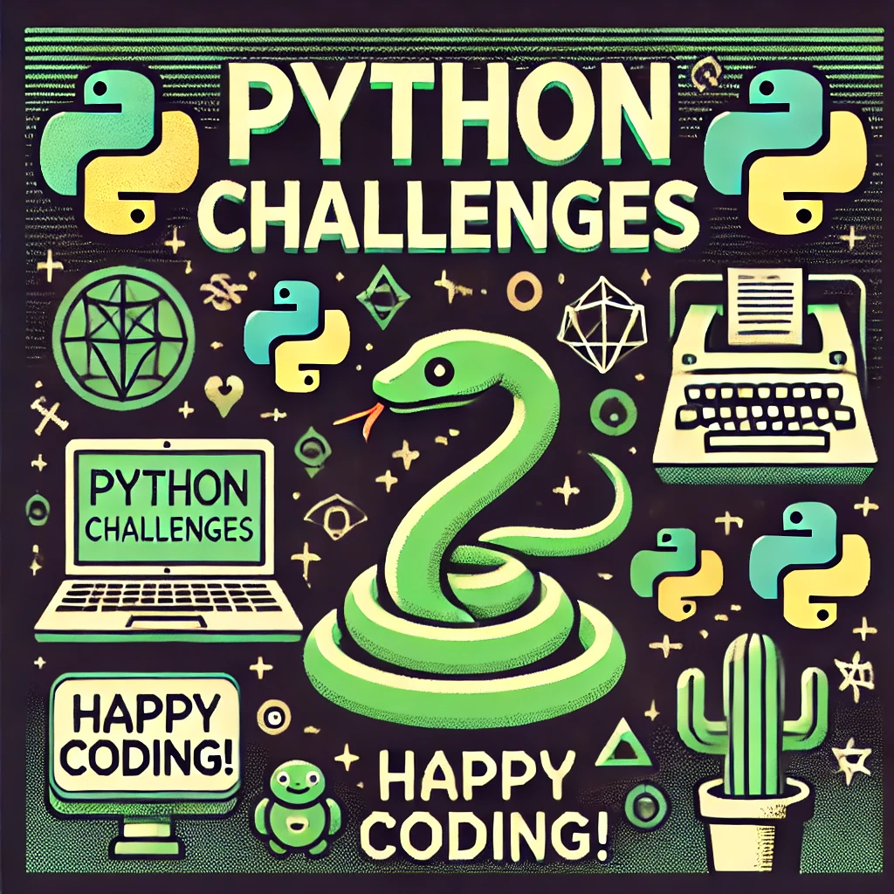

# 🐍 **Python Challenges** 💻
_Repository of coding challenges and exercises solved in Python._

 

---

## 🎯 **About this Repository**
Welcome to my collection of Python programming challenges! Each exercise is designed to improve problem-solving skills, ranging from beginner to advanced levels. If you're looking to sharpen your Python skills, this is the place! 🌱

---

## 🤝 **Contributing**
Feel free to fork this repository, add your own challenges or improve the existing solutions. Contributions are more than welcome! 🌿

🌵 _Happy coding!_ 🐢
